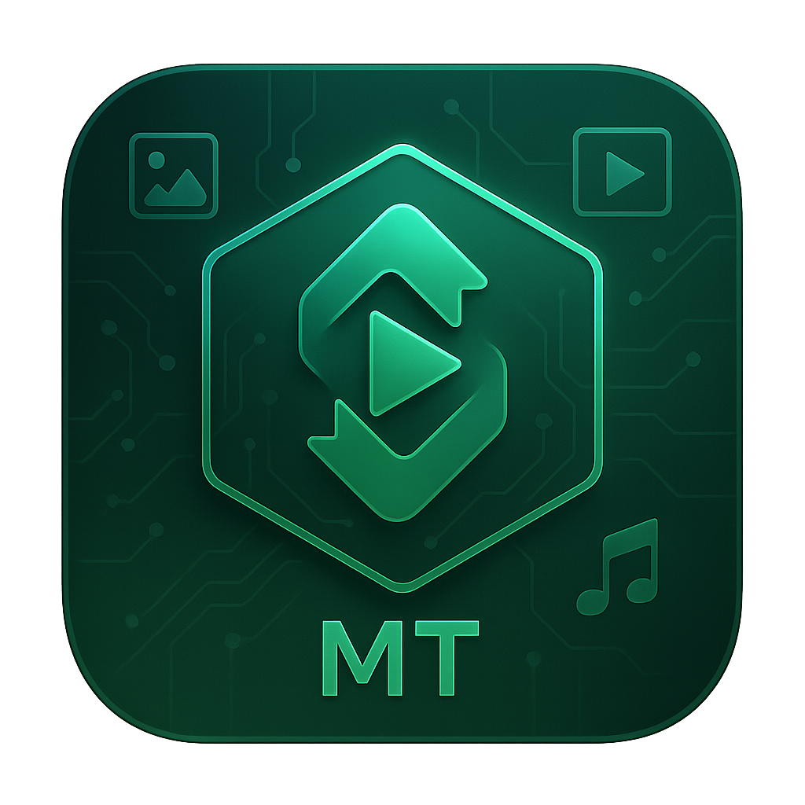

<p align="center">
  
</p>

<h1 align="center">Media Tools</h1>

<p align="center">
  Небольшое десктоп-приложение для апскейла и загрузки медиа.
  <br>
  Делалось чисто «под себя» - без лишнего овер-инжиниринга.
</p>

<p align="center">
  <a href="https://github.com/ser1k01/Media-Tools">
    
  </a>
  
  
  
  
  
  
  
  
</p>

> [!NOTE]  
> Приложение **полностью на русском языке** и актуально на **18.11.2025**.

> [!CAUTION]  
> Для корректной работы видео-части и загрузчика нужен установленный **ffmpeg**, доступный из `PATH`.

---

## 📸 Скриншоты

<p align="center">
  
  
  
</p>

---

## 🧩 Стек и зависимости

> [!TIP]  
> Вся логика и UI собраны в одном `main.py`, чтобы проект было легче таскать между машинами.

**Основные зависимости:**

- `Python 3.10+`
- `PyQt6`
- `Pillow`
- `opencv-python`
- `numpy`
- `yt-dlp`
- `ffmpeg` (отдельная утилита, ставится через установщик/пакетный менеджер)

| Компонент          | Для чего используется                            |
|--------------------|--------------------------------------------------|
| **Python 3.10+**   | Язык, на котором всё крутится                    |
| **PyQt6**          | Окна, виджеты, стили, загрузочный экран          |
| **Pillow**         | Работа с изображениями и GIF                     |
| **opencv-python**  | Ресайз и обработка видео по кадрам               |
| **numpy**          | Массивы данных для OpenCV                        |
| **yt-dlp**         | Загрузка видео/аудио с разных сервисов           |
| **ffmpeg**         | Склейка видео+аудио, конвертация, постобработка  |

---

## 📚 Содержание

- [Идея проекта](#-идея-проекта)
- [Функционал](#-функционал)
  - [Media Upscaler](#-media-upscaler)
  - [Media Downloader](#-media-downloader)
- [Интерфейс и UX](#-интерфейс-и-ux)
- [Структура проекта](#-структура-проекта)
- [Установка и запуск](#-установка-и-запуск)
- [Настройки и профиль](#-настройки-и-профиль)
- [Лицензия и ответственность](#-лицензия-и-ответственность)

---

## 🧠 Идея проекта

> [!IMPORTANT]  
> Проект изначально делался **чисто для себя** - без лишних слоёв архитектуры, DI, «правильных» паттернов и прочего овер-инжиниринга.

**Media Tools** - это компактное десктоп-приложение на Python / PyQt6, в котором собраны два инструмента, которых обычно не хватает «из коробки»:

1. **Media Upscaler** - апскейл / ресайз изображений, GIF и видео.  
2. **Media Downloader** - качалка видео и аудио на базе `yt-dlp`.

Никаких сложных установок: один репозиторий, один `main.py`, тёмный аккуратный интерфейс и пара кнопок, которые делают свою работу.

---

## ⚙️ Функционал

### 🟢 Media Upscaler

Поддерживаемые форматы:

- **Изображения:** `.jpg`, `.jpeg`, `.png`
- **GIF:** покадровая обработка с сохранением анимации
- **Видео:** `.mp4`, `.avi`, `.mov`, `.mkv` и другие, которые понимают OpenCV/ffmpeg

**Что умеет:**

- Drag & Drop: файл можно просто перетащить в выделенную область.
- Автоматически определяет исходное разрешение файла.
- Позволяет задать целевую ширину и высоту (до `10000 px`).
- Для изображений и GIF:
  - использует `Pillow` с `Image.Resampling.LANCZOS` для качественного ресайза;
  - для GIF обрабатываются все кадры с прогрессом.
- Для видео:
  - ресайз каждого кадра через `opencv-python`;
  - при апскейле - `cv2.INTER_LANCZOS4`;
  - при даунскейле - `cv2.INTER_AREA`;
  - временный файл конвертируется и объединяется с оригинальной аудиодорожкой через `ffmpeg`;
  - если ffmpeg не найден, приложение старается корректно сохранить хотя бы полученное видео.

**Пути сохранения:**

Если задана папка сохранения в настройках, файлы падают в:

```text
<выбранная_папка_сохранения>/
└── Media Upscaler/
    └── <имя_файла>_upscaled.<ext>
```

Если папка не задана - результат появляется рядом с исходным файлом.

---

### 🔻 Media Downloader

Графическая обёртка над `yt-dlp` с нормальным UI, прогрессом и отменой.

**Функции:**

- Вставка ссылки на видео (YouTube, Twitter, Instagram и т.д.).
- Выбор качества:
  - **Плохое** - минимальный размер.
  - **Среднее** - до 720p.
  - **Наилучшее** - максимально доступное качество.
- Режимы аудио:
  - **Со звуком** - обычное видео с аудиодорожкой.
  - **Без звука** - только видео.
  - **Только звук** - скачивание аудио-трека.
- При выборе «Только звук» можно указать формат:
  - `MP3`, `M4A`, `WAV`, `OPUS`.
- Прогресс загрузки:
  - процент,
  - скорость (MB/s),
  - скачано / всего.
- Кнопка **«Отмена»** - можно прервать загрузку, не дожидаясь конца.

**Пути сохранения:**

```text
<выбранная_папка_сохранения>/
└── Media Downloader/
    └── <название_видео>.<ext>
```

---

## 🎨 Интерфейс и UX

> [!TIP]  
> Логика простая: минимум кликов, максимум понятности. Никаких скрытых меню и забитого текстом интерфейса.

Основные элементы:

- **Тёмная тема** с градиентным фоном.
- **Экран загрузки при старте:**
  - отдельное окно «Media Tools»,
  - анимация точек (`●`, `●●`, `●●●`, `●●●●`) через `QTimer`.
- **Навигация по вкладкам:**
  - `Upscaler` и `Downloader` в шапке,
  - активная вкладка подсвечивается, расширяется, меняет текст и иконку.
- **Иконки рисуются кодом** (через `QPainter`, `QPainterPath`):
  - профиль,
  - папка,
  - стрелка вверх (апскейл),
  - стрелка вниз (скачивание).
- **Drop-зона для файлов:**
  - подсветка при наведении,
  - изменение рамки и фона при drag-enter / drop,
  - отображение имени выбранного файла.
- **Прогресс-бары:**
  - скруглённые края,
  - градиентная заливка,
  - читаемый текст поверх.

Весь UI и логика - внутри `main.py`, чтобы проект было легко перетаскивать между машинами без кучи модулей.

---

## 🗂 Структура проекта

```text
Media-Tools/
├─ main.py          # основной файл приложения (GUI + логика)
├─ icon.ico         # иконка для билдов/установщика (Windows)
├─ icon.png         # иконка окна приложения / логотип
└─ requirements.txt # список Python-зависимостей
```

Во время работы создаются:

```text
settings.json       # настройки (папка сохранения и др.)
avatar.png          # аватар профиля, если пользователь загрузил
Media Upscaler/     # результаты апскейла (внутри выбранной папки)
Media Downloader/   # скачанные медиа-файлы (внутри выбранной папки)
```

---

## 🧩 Установка и запуск

> [!WARNING]  
> Убедись, что **Python 3.10+** и **ffmpeg** установлены и доступны из командной строки.

### 1. Клонирование репозитория

```bash
git clone https://github.com/ser1k01/Media-Tools.git
cd Media-Tools
```

### 2. (Опционально) виртуальное окружение

```bash
python -m venv venv
```

**Windows:**

```bash
venv\Scripts\activate
```

**Linux / macOS:**

```bash
source venv/bin/activate
```

### 3. Установка зависимостей

```bash
pip install -r requirements.txt
```

### 4. Установка ffmpeg

**Windows:**

- скачать сборку ffmpeg;
- распаковать;
- добавить путь к `bin` в переменную окружения `PATH`.

**Linux (Debian/Ubuntu-пример):**

```bash
sudo apt update
sudo apt install ffmpeg
```

**macOS (Homebrew):**

```bash
brew install ffmpeg
```

### 5. Запуск приложения

```bash
python main.py
```

---

## 👤 Настройки и профиль

Настройки хранятся в `settings.json`:

- выбранная папка для сохранения файлов.

Аватар профиля:

- можно загрузить своё фото - оно сохранится в `avatar.png`;
- в интерфейсе отображается круглый аватар;
- если файла нет, рисуется аккуратный дефолтный силуэт через `QPainter`.

Диалог настроек включает:

- раздел **«Профиль»** (аватар),
- раздел **«Сохранение»** (папка для вывода),
- кнопки **«Сохранить»** и **«Отмена»**.

---

## 📜 Лицензия и ответственность

Проект распространяется по лицензии **MIT** (см. файл [`LICENSE`](./LICENSE)).

> [!CAUTION]  
> Никаких гарантий. Используешь код - делаешь это **на свой страх и риск**:  
> автор не отвечает за любые последствия, баги, потерю данных и т.п.

Можно свободно:

- использовать код,
- форкать,
- менять,
- встраивать в свои проекты (включая коммерческие),

при условии сохранения уведомления об авторских правах и текста лицензии.
